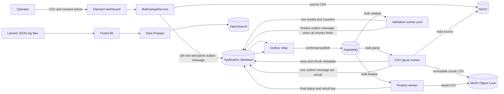
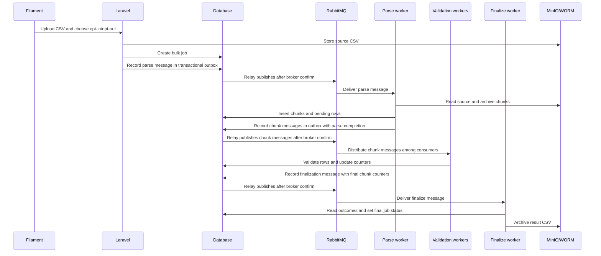
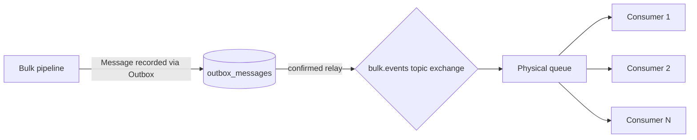
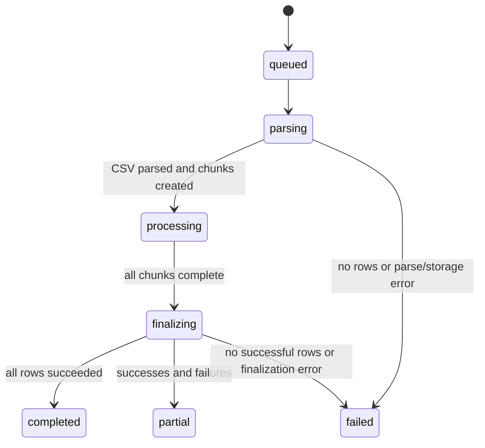

# Bulk CSV Operations

A high-throughput asynchronous pipeline designed for processing massive CSV datasets with strict requirements for horizontal scalability, data immutability, and comprehensive auditability.

The system allows operators to upload CSV files through an authenticated Filament dashboard, processes rows asynchronously using RabbitMQ workers, archives intermediate and final artifacts in MinIO with WORM (Write Once Read Many) object lock, and ships structured logs to OpenSearch.

## Architecture



An upload is one job. Its parser reads that CSV sequentially and creates chunk records. Messages are first recorded in the RabbitMQ module's transactional outbox with the corresponding database changes, then a relay publishes them with broker confirms. Validation is the stage intended to scale horizontally: RabbitMQ distributes chunk messages among consumers of the module-declared validation queue.



### Declared RabbitMQ topology

The bulk pipeline declares its exchange, routing keys, queues, handlers, retry policy, and scaling in `app/Domains/Bulk/Messaging/BulkMessaging.php`. The module creates durable work, retry, and dead-letter quorum queues for each declared queue.



Queue names and routing keys are code-declared; they are listed with `php artisan rabbitmq:topology` and applied with `php artisan rabbitmq:declare-topology`. The topology command declares the exchange, bindings, and retry/dead queues, so the application no longer relies on dashboard-managed broker queue mappings.

## Technical Deep Dive

### The Chunking Pipeline
To process multi-gigabyte files without triggering Out-of-Memory (OOM) errors, the system implements a streaming chunking strategy:
1. **Streaming**: The `ParseBulkCsvHandler` uses a `BulkCsvStreamer` (PHP Generator) to read the source CSV row-by-row.
2. **Buffering**: Rows are buffered into chunks of 1,000 records.
3. **Immutable Archiving**: Each chunk is written to a temporary file and then uploaded to **WORM storage** (`bulk-chunks/{uuid}/chunk-xxxx.csv`).
4. **Work Distribution**: One `BulkValidate` message is published to RabbitMQ per chunk, allowing a pool of validation workers to process the file in parallel.

### WORM Storage Architecture
The system uses **S3 Object Lock** (via MinIO) to ensure an immutable audit trail. 
- **Scope**: Both intermediate chunks and final results are stored with WORM lock.
- **Constraint**: Once written, artifacts cannot be modified or deleted for the configured retention period (default 365 days).
- **Rationale**: This ensures that the exact data used for a specific consent action is preserved for compliance and auditing, preventing tampering after processing.

### Concurrency & Reliability
To prevent multiple workers from processing the same chunk in a distributed environment, the system uses an **atomic claiming mechanism**:
- **Conditional Update**: Before processing, a worker executes a single atomic database query:
  `UPDATE bulk_job_chunks SET status = 'processing', attempts = attempts + 1 WHERE id = ? AND status = 'pending'`
- **Distributed Lock**: If the affected row count is not 1, the worker aborts, knowing another consumer has already claimed the chunk.
- **Fault Tolerance**: If a worker crashes, the `attempts` counter and `processing_started_at` timestamp allow for detection and reprocessing of stalled chunks.

## Data Model Specification

### BulkJob (The Job State)
The root entity tracking the overall lifecycle.
| Field | Description |
| :--- | :--- |
| `uuid` | Unique process identifier used in logs and storage paths. |
| `action` | The consent action (`opt_in` or `opt_out`). |
| `status` | Current lifecycle stage (see Processing Lifecycle). |
| `total_rows` | Total data rows discovered during parsing. |
| `result_path` | WORM path to the final result CSV. |

### BulkJobChunk (The Work Unit)
Tracks a specific segment of the original CSV.
| Field | Description |
| :--- | :--- |
| `row_from` / `row_to` | The range of rows contained in this chunk. |
| `worm_path` | Path to the immutable CSV chunk in WORM storage. |
| `status` | `Pending` $\rightarrow$ `Processing` $\rightarrow$ `Completed`. |

### BulkJobRow (The Result Unit)
The granular outcome for every single record.
| Field | Description |
| :--- | :--- |
| `user_id` | Normalized user identifier. |
| `status` | `Success` or `Failed`. |
| `error_code` | Specific failure reason (e.g., validation error, API timeout). |
| `additional_data` | JSON blob containing all non-required CSV columns. |

## Requirements

- PHP 8.3 or newer and Composer
- Docker Compose
- A Laravel-supported database; `.env.example` uses SQLite
- Node.js/npm only when building frontend assets

The Composer dependencies include Laravel 13, Filament 5, `php-amqplib`, and the Flysystem S3 driver. Docker Compose provides RabbitMQ, MinIO, OpenSearch, OpenSearch Dashboards, Data Prepper, and Fluent Bit.

## Local setup

1. Install PHP dependencies and prepare the environment:

    ```sh
    composer install
    cp .env.example .env
    php artisan key:generate
    ```

2. Add a strong local value for `OPENSEARCH_INITIAL_ADMIN_PASSWORD` to `.env`. This variable is required by the OpenSearch Compose service. Keep it out of version control.

3. Start infrastructure and create the schema:

    ```sh
    docker compose up -d
    php artisan bulk:ensure-worm-bucket
    php artisan migrate
    php artisan rabbitmq:check
    php artisan rabbitmq:declare-topology
    ```

4. Create a Filament operator account:

    ```sh
    php artisan make:filament-user
    ```

5. Start the Laravel web server:

    ```sh
    php artisan serve
    ```

6. Open `http://127.0.0.1:8000/admin`, sign in, and select **Bulk jobs → Create**. The success notification displays the process ID, which is the job UUID.


## CSV upload format

Upload a `.csv` file in Filament. The first CSV record is the header row.

### Input Format
Required columns:
| Column        | Rule                                                                                                                                |
| ------------- | ----------------------------------------------------------------------------------------------------------------------------------- |
| `userid`      | Must be present and non-empty in each data row.                                                                                     |
| `phonenumber` | Must be present. Spaces, hyphens, and parentheses are removed; the remaining value must be an optional `+` followed by 8–15 digits. |

**Example Input:**
| userid | phonenumber | email | account_type |
| :--- | :--- | :--- | :--- |
| 12345 | +1234567890 | user@example.com | premium |
| 67890 | 0987654321 | test@demo.com | basic |

Headers are matched case-insensitively after removing spaces, hyphens, and underscores. Missing required or duplicate normalized headers fail parsing. A UTF-8 BOM in the first header is handled, and entirely empty data rows are skipped. Other columns, such as `email` or `account_type`, are preserved as `additional_data` and carried into chunk and result CSVs.

### Result Format
The final result CSV produced by the `FinalizeBulkHandler` contains:
| Column | Description |
| :--- | :--- |
| `userid` | The normalized user ID. |
| `phonenumber` | The normalized phone number. |
| `status` | `Success` or `Failed`. |
| `error_code` | Error identifier if status is `Failed`. |
| `error_message` | Human-readable error description. |
| `...` | All original `additional_data` columns. |

**Example Result:**
| userid | phonenumber | status | error_code | error_message | email | account_type |
| :--- | :--- | :--- | :--- | :--- | :--- | :--- |
| 12345 | +1234567890 | Success | | | user@example.com | premium |
| 67890 | 0987654321 | Failed | VAL_001 | Invalid phone format | test@demo.com | basic |

Select `opt_in` or `opt_out` when uploading. Opt-in asks the configured consent service to enable consent; opt-out asks it to withdraw consent. A row succeeds only if validation passes and the consent service accepts the update. If `CONSENT_SERVICE_BASE_URL` is empty, the application uses a null consent client, which reports success for local development/testing.

## Processing lifecycle



| Status       | Meaning                                                                                                                  |
| ------------ | ------------------------------------------------------------------------------------------------------------------------ |
| `queued`     | Job and source object created; parse message recorded in the transactional outbox.                                        |
| `parsing`    | Parse worker is reading the CSV and creating chunks.                                                                     |
| `processing` | Validation chunks are being processed.                                                                                   |
| `finalizing` | Result CSV is being generated and archived.                                                                              |
| `completed`  | At least one row succeeded and no rows failed.                                                                           |
| `partial`    | At least one row succeeded and at least one failed. Processing is finished; inspect the result CSV for row-level errors. |
| `failed`     | Parsing/finalization failed, the CSV had no data rows, or no rows succeeded.                                             |

The status API also returns `total_rows`, `processed_rows`, `success_rows`, `failed_rows`, `progress_percent`, `result_available`, and `error_summary`.

## Worker operations

Start the module's outbox relay and worker supervisor as long-running processes (under Supervisor, systemd, or a container orchestrator):

```sh
php artisan rabbitmq:relay-outbox
php artisan rabbitmq:work
```

The `bulk.validate` queue is declared with a maximum of three consumers; `rabbitmq:work` scales it based on backlog. Each consumer prefetches one message. Chunks are not assigned as fixed ranges to workers.

The parse queue has one consumer by default: one parse message represents one whole CSV, and one parse handler reads that file sequentially. The last validation handler records a `bulk.finalize.requested` outbox message in the same transaction as the final chunk counters.

In production, use Supervisor, systemd, or a container orchestrator to keep consumers running and restart them after deployments/configuration changes. `docker compose up -d` starts infrastructure; it does not start Laravel worker commands.

The RabbitMQ module acknowledges a message after the handler succeeds. On exceptions it confirms a copy to the queue's retry or dead-letter queue before acknowledging the original. The handlers are idempotent, and a conditional database update claims each pending chunk so two workers do not process it simultaneously.

## Storage and retention

| Artifact   | Location                                  | Purpose                                             |
| ---------- | ----------------------------------------- | --------------------------------------------------- |
| Source CSV | MinIO under `inputs/{job UUID}/...csv`    | Original uploaded file read by the parse worker.    |
| Chunk CSVs | WORM object keys under `bulk-chunks/...`  | Immutable chunk snapshots stored before validation. |
| Result CSV | WORM object keys under `bulk-results/...` | Final row outcomes and errors.                      |

## OpenSearch logging

Laravel's default `stack` writes to the normal local log and the `opensearch-json` daily JSON file at `storage/logs/json/laravel-YYYY-MM-DD.log`. Fluent Bit tails that directory and posts to Data Prepper, which writes daily indexes named `bulk-logs-YYYY.MM.DD`.

OpenSearch Dashboards is available at `http://127.0.0.1:5601` in local Compose. Search recent application events with the index wildcard:

```json
GET bulk-logs-*/_search
{
  "size": 50,
  "sort": [{ "@timestamp": { "order": "desc" } }],
  "query": { "match_all": {} }
}
```

Filter events for a process UUID:

```json
GET bulk-logs-*/_search
{
  "query": {
    "match": {
      "context.bulk_job_uuid": "YOUR_PROCESS_ID"
    }
  }
}
```

Application events include upload queued, parsing started/completed, validation chunk completed, job finalized, and RabbitMQ errors. Sensitive context keys are redacted. The Data Prepper ingestion port is bound to localhost in Compose; its local HTTP source has no authentication or TLS and must not be exposed beyond a trusted development host.
