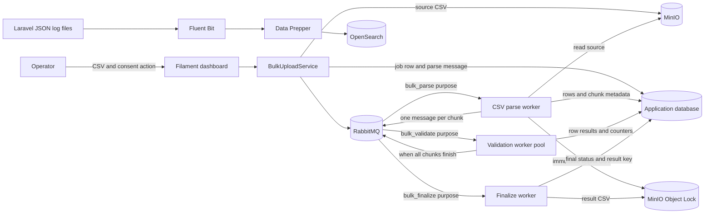
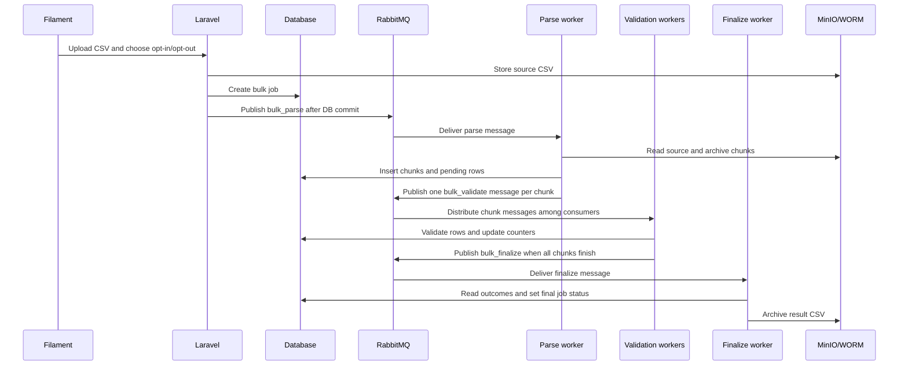
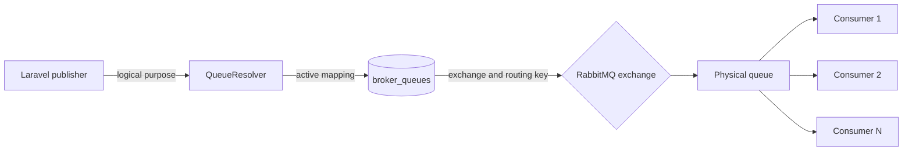
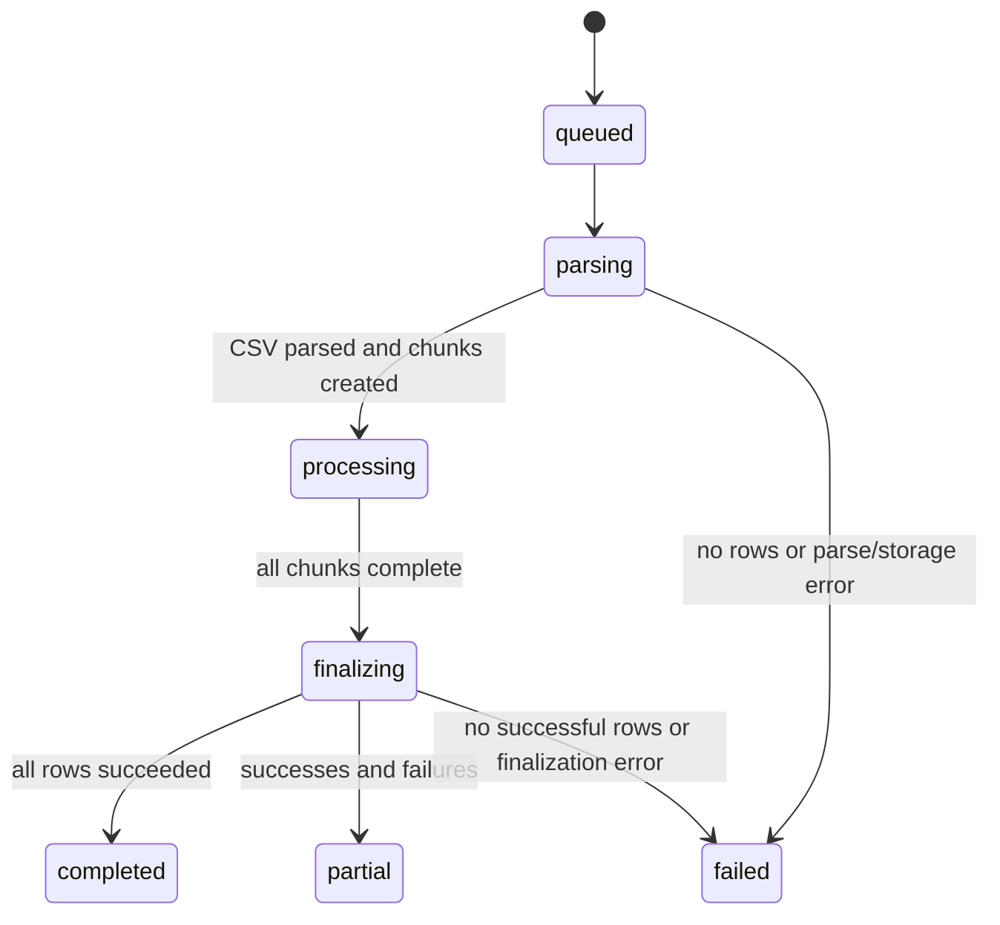

# Bulk CSV Operations

Laravel application for uploading CSV files through an authenticated Filament dashboard, processing rows asynchronously with RabbitMQ workers, archiving source/chunk/result files in MinIO with WORM object lock, and shipping structured application logs to OpenSearch.


## Architecture



An upload is one job. Its parser reads that CSV sequentially and creates chunk records. Validation is the stage intended to scale horizontally: RabbitMQ distributes chunk messages among consumers of the same mapped validation queue.



### Queue purposes and physical queues

The application has fixed logical purposes: `bulk_parse`, `bulk_validate`, `bulk_finalize`, and `bulk_dlq`. Each purpose maps to a configurable physical RabbitMQ queue in `broker_queues`.



If both the mapping's `exchange` and `RABBITMQ_DEFAULT_EXCHANGE` are empty, the publisher uses RabbitMQ's built-in default exchange, which is direct. The routing key defaults to the physical queue name. A named exchange must be declared and bound to its queue in RabbitMQ; this application stores the exchange name and routing key but does not declare exchanges or bindings.

## Requirements

- PHP 8.3 or newer and Composer
- Docker Compose
- A Laravel-supported database; `.env.example` uses SQLite
- Node.js/npm only when building frontend assets

The Composer dependencies include Laravel 13, Filament 5, `php-amqplib`, and the Flysystem S3 driver. Docker Compose provides RabbitMQ, MinIO, OpenSearch, OpenSearch Dashboards, Data Prepper, and Fluent Bit.

## Local setup

1. Install PHP dependencies and prepare the environment:

    ```sh
    composer install
    cp .env.example .env
    php artisan key:generate
    ```

2. Add a strong local value for `OPENSEARCH_INITIAL_ADMIN_PASSWORD` to `.env`. This variable is required by the OpenSearch Compose service. Keep it out of version control.

3. Start infrastructure and create the schema:

    ```sh
    docker compose up -d
    php artisan migrate
    ```

4. Create a Filament operator account:

    ```sh
    php artisan make:filament-user
    ```

5. Start the Laravel web server:

    ```sh
    php artisan serve
    ```

6. Open `http://127.0.0.1:8000/admin`, sign in, and select **Bulk jobs → Create**. The success notification displays the process ID, which is the job UUID.


## CSV upload format

Upload a `.csv` file in Filament. The first CSV record is the header row.

Required columns:

| Column        | Rule                                                                                                                                |
| ------------- | ----------------------------------------------------------------------------------------------------------------------------------- |
| `userid`      | Must be present and non-empty in each data row.                                                                                     |
| `phonenumber` | Must be present. Spaces, hyphens, and parentheses are removed; the remaining value must be an optional `+` followed by 8–15 digits. |

Headers are matched case-insensitively after removing spaces, hyphens, and underscores. Missing required or duplicate normalized headers fail parsing. A UTF-8 BOM in the first header is handled, and entirely empty data rows are skipped. Other columns, such as `email` or `account_type`, are preserved as `additional_data` and carried into chunk and result CSVs; they are not sent to the consent API by default.

Select `opt_in` or `opt_out` when uploading. Opt-in asks the configured consent service to enable consent; opt-out asks it to withdraw consent. A row succeeds only if validation passes and the consent service accepts the update. If `CONSENT_SERVICE_BASE_URL` is empty, the application uses a null consent client, which reports success for local development/testing.

## Processing lifecycle



| Status       | Meaning                                                                                                                  |
| ------------ | ------------------------------------------------------------------------------------------------------------------------ |
| `queued`     | Job and source object created; parse message published after the database commit.                                        |
| `parsing`    | Parse worker is reading the CSV and creating chunks.                                                                     |
| `processing` | Validation chunks are being processed.                                                                                   |
| `finalizing` | Result CSV is being generated and archived.                                                                              |
| `completed`  | At least one row succeeded and no rows failed.                                                                           |
| `partial`    | At least one row succeeded and at least one failed. Processing is finished; inspect the result CSV for row-level errors. |
| `failed`     | Parsing/finalization failed, the CSV had no data rows, or no rows succeeded.                                             |

The status API also returns `total_rows`, `processed_rows`, `success_rows`, `failed_rows`, `progress_percent`, `result_available`, and `error_summary`.

## Worker operations

Start one long-running process per purpose in separate terminals:

```sh
php artisan bulk:consume bulk_parse
php artisan bulk:consume bulk_validate
php artisan bulk:consume bulk_finalize
```

Run additional copies of `php artisan bulk:consume bulk_validate` to increase validation concurrency. All copies consume the same mapped queue; RabbitMQ distributes chunk messages among available consumers. With `RABBITMQ_PREFETCH_COUNT=1`, each worker reserves at most one unacknowledged message, which generally improves fairness. Chunks are not assigned as fixed ranges to workers.

The parse consumer differs: one parse message represents one whole CSV, and one parse handler reads that file sequentially. Additional parse processes can handle separate uploads, but do not parallelize a single CSV. The last validation handler to complete publishes `bulk_finalize` after `chunks_done` reaches `chunks_total`.

In production, use Supervisor, systemd, or a container orchestrator to keep consumers running and restart them after deployments/configuration changes. `docker compose up -d` starts infrastructure; it does not start Laravel worker commands.

The RabbitMQ consumer acknowledges a message after the handler succeeds. On exceptions it logs the error, republishes a retry with an incremented attempt count, and eventually publishes to the DLQ purpose. A conditional database update claims each pending chunk so two workers do not process it simultaneously.

## Storage and retention

| Artifact   | Location                                  | Purpose                                             |
| ---------- | ----------------------------------------- | --------------------------------------------------- |
| Source CSV | MinIO under `inputs/{job UUID}/...csv`    | Original uploaded file read by the parse worker.    |
| Chunk CSVs | WORM object keys under `bulk-chunks/...`  | Immutable chunk snapshots stored before validation. |
| Result CSV | WORM object keys under `bulk-results/...` | Final row outcomes and errors.                      |

## OpenSearch logging

Laravel's default `stack` writes to the normal local log and the `opensearch-json` daily JSON file at `storage/logs/json/laravel-YYYY-MM-DD.log`. Fluent Bit tails that directory and posts to Data Prepper, which writes daily indexes named `bulk-logs-YYYY.MM.DD`.

OpenSearch Dashboards is available at `http://127.0.0.1:5601` in local Compose. Search recent application events with the index wildcard:

```json
GET bulk-logs-*/_search
{
  "size": 50,
  "sort": [{ "@timestamp": { "order": "desc" } }],
  "query": { "match_all": {} }
}
```

Filter events for a process UUID:

```json
GET bulk-logs-*/_search
{
  "query": {
    "match": {
      "context.bulk_job_uuid": "YOUR_PROCESS_ID"
    }
  }
}
```

Application events include upload queued, parsing started/completed, validation chunk completed, job finalized, and RabbitMQ errors. Sensitive context keys are redacted. The Data Prepper ingestion port is bound to localhost in Compose; its local HTTP source has no authentication or TLS and must not be exposed beyond a trusted development host.
